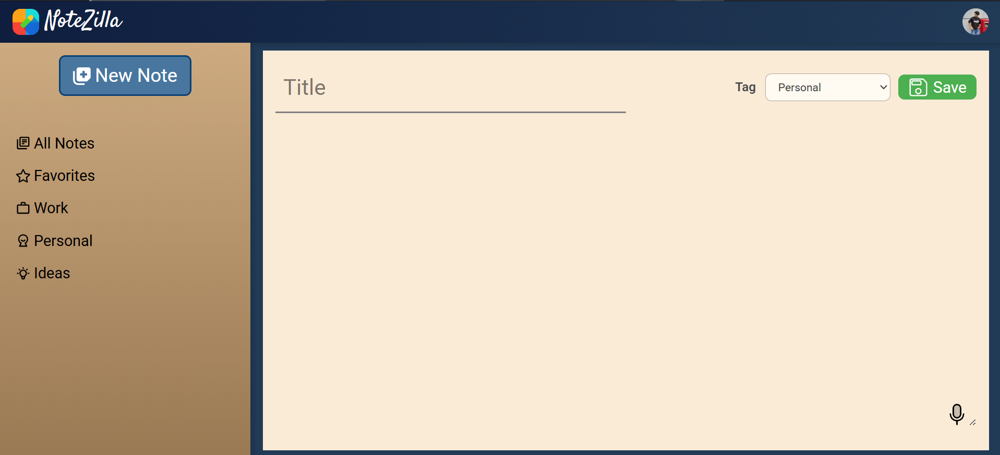
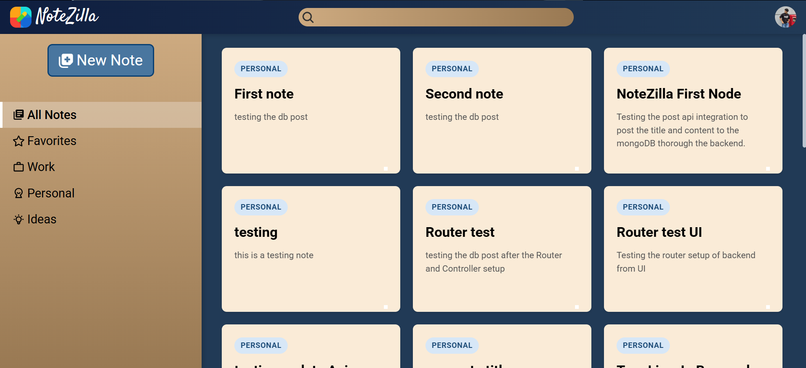
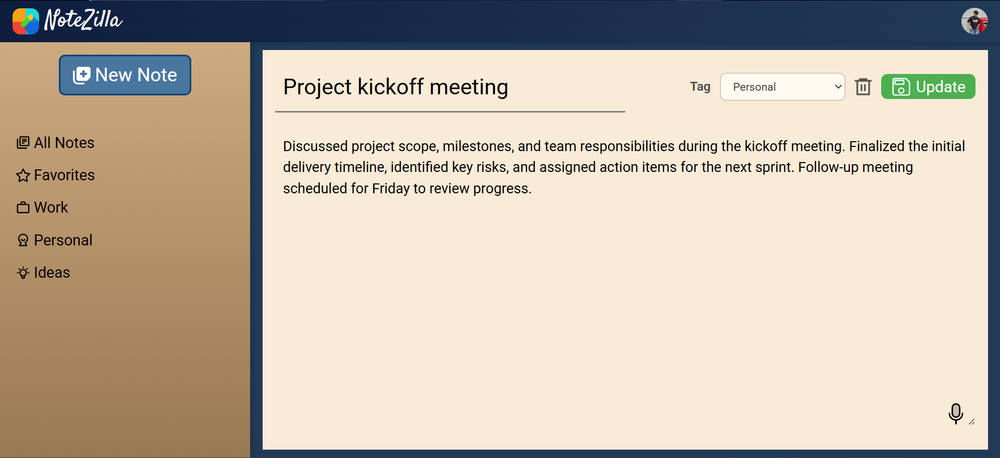

# Notezilla

A full-stack note-taking web application built with React (TypeScript) on the frontend and Node.js/Express with MongoDB on the backend.

---

## Demo






## Features

### Note Management (CRUD)

- **Create Notes** — Write and save notes with a title and content.
- **Read Notes** — Browse all notes or view a specific note by ID.
- **Update Notes** — Edit existing notes inline and save changes.
- **Delete Notes** — Permanently remove notes with a single click.

### Note Tags / Categories

Notes can be tagged and filtered into four categories:

- **Personal** — Default category for personal notes.
- **Work** — Notes related to work tasks.
- **Ideas** — Capture ideas and inspiration.
- **Favorites** — Mark important notes as favorites.

Each category has its own dedicated page for quick access.

### Voice-to-Text Input

- **Speech Recognition** — Dictate note titles or content using your microphone via the Web Speech API.
- Supports interim (real-time) transcription and auto-stops on final speech result.
- Can target either the title or content field independently.

### User Feedback & Notifications

- **Toast Notifications** — Real-time success and error feedback using `react-toastify` (e.g., note saved, note deleted, validation errors).

### Navigation & Layout

- **Sidebar Navigation** — Quick access to all category pages (All Notes, Favorites, Work, Personal, Ideas).
- **Header** — Persistent top navigation bar.
- **React Router** — Client-side routing for a smooth single-page-app experience.

### Responsive UI

- Built with **Tailwind CSS** for a clean, responsive design.
- Animated icons via **Lordicon**.

---

## Tech Stack

| Layer     | Technology                 |
| --------- | -------------------------- |
| Frontend  | React 19, TypeScript, Vite |
| Styling   | Tailwind CSS v4            |
| Routing   | React Router v7            |
| HTTP      | Axios                      |
| Icons     | React Icons, Lordicon      |
| Toasts    | React Toastify             |
| Backend   | Node.js, Express v5        |
| Database  | MongoDB with Mongoose      |
| Dev Tools | Nodemon, ESLint            |

---

## Project Structure

```
Notezilla/
├── Backend/
│   ├── server.js
│   └── src/
│       ├── config/db.js          # MongoDB connection
│       ├── controllers/
│       │   └── noteController.js # CRUD logic
│       ├── models/
│       │   └── noteModel.js      # Mongoose schema
│       └── routes/
│           └── notesRoutes.js    # API routes
└── Frontend/
    └── src/
        ├── components/           # Header, Sidebar
        ├── layouts/              # MainLayout
        ├── models/               # TypeScript interfaces & enums
        ├── pages/                # NotesPage, NewNotePage, FavoritesPage, etc.
        ├── services/             # API calls, Axios instance, Speech Recognition hook
        └── utils/                # String helpers
```

---

## API Endpoints

| Method | Endpoint                    | Description         |
| ------ | --------------------------- | ------------------- |
| POST   | `/api/notes/`               | Create a new note   |
| GET    | `/api/notes/getAllNotes`    | Get all notes       |
| GET    | `/api/notes/getNote/:id`    | Get a note by ID    |
| PUT    | `/api/notes/updateNote/:id` | Update a note by ID |
| DELETE | `/api/notes/deleteNote/:id` | Delete a note by ID |

---

## Getting Started

### Prerequisites

- Node.js (v18+)
- MongoDB (local or Atlas)

### Backend Setup

```bash
cd Backend
npm install
```

Create a `.env` file in the `Backend/` directory:

```env
MONGO_URI=your_mongodb_connection_string
PORT=5000
```

Start the server:

```bash
npx nodemon server.js
```

### Frontend Setup

```bash
cd Frontend
npm install
npm run dev
```

The app will be available at `http://localhost:5173`.

---

## Note Schema

```js
{
  title: String; // required
  content: String; // optional, defaults to ""
  tag: String; // enum: "favorite" | "work" | "personal" | "ideas"
  createdAt: Date; // auto-generated
  updatedAt: Date; // auto-generated
}
```
